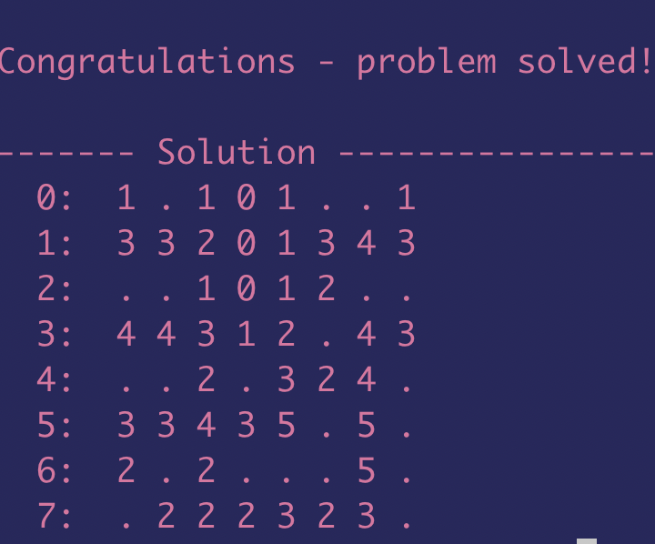

# minesweeper_solver
C and Assembly Implementation of a minesweeper solver

<h2>To run the C code:</h2>

    cd /C\ Implementation

    make

    ./msweep 0.25 -1 1

Make command will create an executable msweep which can be executed on the command line using 3 flags:

        (i) first denoting the probability of a square in the minefield being a mine

        (ii) the seed denoting the placement of mines in the field, -1 for random placement

        (iii) 1 indicating a verbose printout on the terminal and 0 for otherwise.

The ouput would look something like this:

Note: dots are indicative of mines.

<h2>To run the Assembly Implementation:</h2>

This part was coded specifically with performace metrics like Dynamic Execution Length Static Instructions and Operand storage requirements in mind.

You'll have to download the MiSaSiM MIPS ISA Simulator from http://lindawills.ece.gatech.edu/misasim/index.html to run the assembly code.

